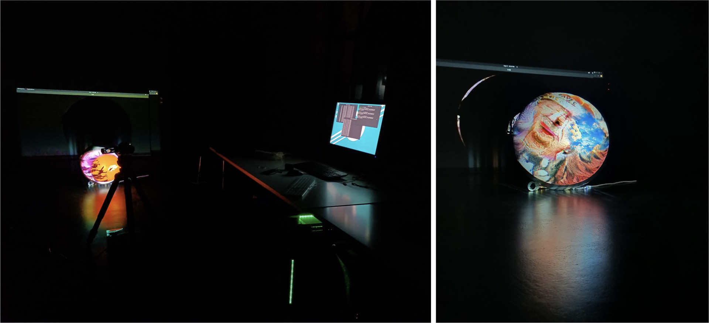

&nbsp;
&nbsp;

# Art愛 / ArtAI

[ArtAI](https://artai.silentbyte.com) is an interactive art installation that collects people's ideas in real-time from social media and uses deep learning and AI art generation to curate these ideas into a dynamic display. This repository represents our submission for the [SAAI Factory - Hackathon on Art and AI](https://devpost.com/software/art-artai). Technologies used: Godot, GDScript, Python, VQGAN+CLIP, Twitter API.

The project page [can be found here](https://devpost.com/software/art-artai). Your vote is highly appreciated. 😊

An online demo is [available here](https://artai.silentbyte.com).

Watch a video of the [art installation on YouTube](https://www.youtube.com/watch?v=kDFc27o_D-8).

Follow us on Twitter: [@RicoBeti](https://twitter.com/RicoBeti), [@sulu35619916](https://twitter.com/sulu35619916).

## Why the name?

Art愛 is a combination of the English word "Art" with the Chinese character "愛", which is pronounced "ai", meaning "love". The pink heart has been used as a stylization of the sub-character "心", which means "heart".

## Inspiration

Digital art is growing more popular at a rapid pace, including generative art using neural networks and machine learning. We wanted to create something that is unique, dynamic, and allows for audience-participation. As our team consists of a software engineer and an artist, this hackathon was a great opportunity for interdisciplinary collaboration and we considered this project as our personal challenge to learn more about each other's field of work.

## What it does

The general idea is to use deep learning and neural networks to generate visual art and music, and then curate individual pieces of generative art into a dynamic display automatically in a way that is visually pleasing through motion and animation. Instead of using a flat display, we project the art onto a spherical surface. To further increase immersion, people are able to walk around the installation and inspect it from different angles. Additionally, we added a real-time aspect and audience-integration.

We first ask the audience to come up with a title of a scene/painting. Anything they can imagine, really, then post this on Twitter along with the hashtag #artai. We then fetch this title in real-time and use deep learning to generate an image that is somehow related to what the user wanted to see. Finally, we combine and render the generated images dynamically in an interesting way.

## How we built it

### Core System

The core system consists of four components:

1. **The Central Hub** is a data store that connects all the other parts of the system.
2. **The Tweet Fetcher** receives tweets containing the hashtag #artai in real-time and stores them as jobs in the central hub.
3. **The Generator** then picks out a new tweet from the central hub and starts a machine learning inference process based on VQGAN+CLIP. Once this process has completed, the generated image will be sent back to the central data store.
4. **The Curator**, which is the front-end renderer, will load this image into memory and render it using real-time graphics along with previously generated images to unify them into a single dynamic display.

This architecture allows different components to run on the cloud in a distributed fashion if desired.

### The Central Hub

The Central Hub ([view source](https://github.com/SilentByte/artai/tree/master/hub)) is written in Python and provides a simple RESTful interface for creating and retrieving jobs, and for storing the generated images. It is backed by a SQLite database. Set up as a Docker container, it is trivial to build and run.

### The Tweet Fetcher

The Tweet Fetcher ([view source](https://github.com/SilentByte/artai/tree/master/twitter)) is also written in Python and set up as a Docker container. It uses the [Official Twitter API](https://developer.twitter.com/en/portal/products) to receive tweets in real-time. For each tweet, it applies a basic profanity filter to reduce the chances of images being generated that may be offensive.

### The Generator

The Generator ([view source](https://github.com/SilentByte/artai/tree/master/generator)), also based on Python, fetches tweets from the Central Hub and starts the machine learning inference process which is powered by [VQGAN+CLIP](https://github.com/nerdyrodent/VQGAN-CLIP.git). Input parameters, such as the size of the generative art and the number of iterations to perform, can be configured. Depending on the configuration and the GPU used, this process may take a few seconds to complete for each tweet.

### The Curator

The Curator ([view source](https://github.com/SilentByte/artai/tree/master/renderer)) is the most complex component of this project. It is responsible for the rendering of the real-time graphics, and works not unlike a video game. It has been created using the amazing open-source [Godot Game Engine](https://godotengine.org).

We employ a variety of techniques to achieve the desired effects. Images are loaded dynamically as soon as they have been generated from a user's tweet and then are seamlessly combined with other images already being displayed through fading, color effects, and blending. We also make heavy use of shaders to add additional effects such as distortions that align with the music through spectrum analysis.

Ultimately, once a frame has been curated, it will be transformed into a sphere using a fish-eye shader. This allows us to reduce distortion when projecting the scene onto a spherical display surface.

The front-end is highly customizable and features many settings and adjustments so that the rendered image can be centered properly onto the physical display surface when using a projector.

### The Exhibition Setup

Everything up to this point has been done in software. Of course, we also need a physical setup for display at an exhibition.

For the display surface, we used an inflatable ball in a practical size and spray painted it white for better visual quality. The size of the spherical display surface is adjustable depending on the constraints at the exhibition.

A projector is then placed at a suitable location to project the image onto the spherical display surface. We chose to project from above to allow the audience to walk around the setup.

We achieved the best results in a dark room with a polished floor, which produces a nice-looking reflection. Speakers should ideally be placed close to the display, either behind or below. Since we are performing music spectrum analysis in The Curator, the graphics change depending on the current beat of the music.

## Challenges we ran into

### Time Zones

Dealing with time zones proved difficult at times. We are based in Australia and Germany, so communicating with the other side of the planet was not always trivial but nothing that we could not overcome. :-)

### GPUs & Cost

Performing machine learning inference based on VQGAN+CLIP requires fast GPUs and graphics cards with as much video RAM as possible. Unfortunately, it was a little difficult to get our hands on those things, especially in this current market due to chip shortages. To bootstrap the project, we decided to use cloud-based GPUs (AWS EC2 G4 instances) which, of course, came at a price. For the final presentation, we were able to use CPUs/GPUs from HfG Karlsruhe to perform inference in real-time.

## Accomplishments that we're proud of

We are proud of the results of this interdisciplinary collaboration and that we managed to bring our initial ideas to life in the form of a fully fledged out art installation that could be displayed at an exhibition.

## What we learned

During the course of this project, we had the chance to try out various things that were new to us from an entirely different field of work. It was a great experience to gain exposure in each other's specialities.

## What's next for ArtAI

There are four paths we have yet to take:

1) We would like to implement a feature that takes the image that has been generated based on the idea of a Twitter user and sends it back as a Tweet to that user. This way, the user gets to enjoy his or her idea during an exhibition and receives something to "take home".

2) In order to improve the quality of the generated images, we need to procure more powerful GPUs so that the system can be run in parallel and complete in a shorter period of time.

3) Keep learning new things!

4) We would absolutely love to see ArtAI at an exhibition. ❤️
